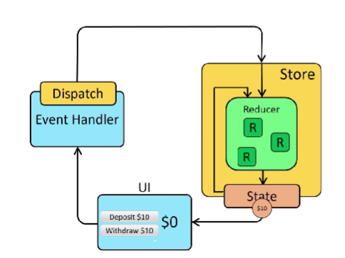
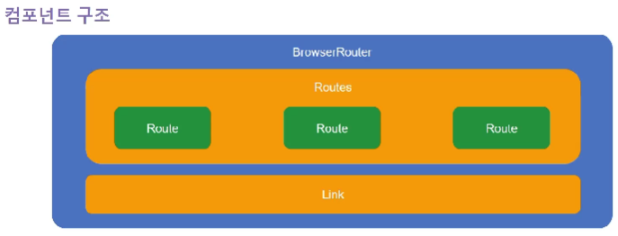
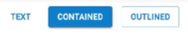
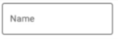
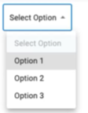
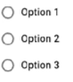
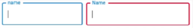
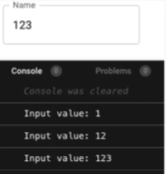

# FRONT END

---

<a href="#웹_접근성_및_seo">웹 접근성 및 SEO</a>  
<a href="#reactjs_소개_및_개발_환경_설정">React.js 소개 및 개발 환경 설정</a>  
<a href="#reactjs_컴포넌트_작성_및_구조화">React.js 컴포넌트 작성 및 구조화</a>  
<a href="#reactjs_상태_관리_state-props">React.js 상태 관리 (state,props)</a>  
<a href="#reactjs_이벤트_처리_및_폼_관리">React.js 이벤트 처리 및 폼 관리</a>  
<a href="#reactjs_컨텍스트_api">React.js 컨텍스트 API</a>  
<a href="#reactjs_라우팅_react_router">React.js 라우팅 (React Router)</a>  
<a href="#reactjs_비동기_데이터_처리_ajax_axios">React.js 비동기 데이터 처리 (Ajax, axios)</a>  
<a href="#mui_소개_및_기본">MUI 소개 및 기본</a>  
<a href="#ui_컴포넌트_구성">UI 컴포넌트 구성</a>  
<a href="#mui를_사용한_레이아웃_및_반응형_디자인">MUI를 사용한 레이아웃 및 반응형 디자인</a>  


--- 
# React.js 설치 사이트

접속 후 설치 
<a href="https://nodejs.org/en"> 노드js 사이트 </a>

# 프로젝트 생성 방법
create-react {프로젝트 이름}

# 필요한 패키지 설치방법
프로젝트 경로로 이동 cd {프로젝트 이름}  
npm install --save {package}

---
# 웹_접근성_및_SEO

### 웹 접근성
`웹 사이트를 사용하는 모든 사람들이 정보를 동등하게 이용할 수 있게 만드는 것을 의미 - SEO(검색 엔진 최적화)에도 도움이 됨`

- 웹 접근성의 중요성
    - 모든 사용자의 접근 보장
        - 웹 사이트를 사용하는 모든 사람들이 정보를 동등하게 이용할 수 있도록 만드는 원칙
    - 법적 요건 충족
        - 많은 국가에선 웹 접근성이 법적인 요구사항
    - 사용성과 호환성 향상
        - 웹사이트의 사용서을 개선하며, 다양한 브라우저, 장치, 운영체제에서 웹사이트가 제대로 작동하는데 도움이 됨
        - 검색 엔진 최적화(SEO)에 유리하므로, 웹 사이트의 가시성을 향상시키는 데도 도움이 됨

### 웹 접근성 준수 방법
- 적정한 대체 텍스트
    - 이미지, 비디오, 오디오와 같은 비텍스트 콘텐츠에는 해당 콘텐츠의 내용과 기능을 설명하는 대체 텍스트가 필요
    - 이를 통해 스크린Reader를 사용하는 사용자도 콘텐츠를 이해할 수 있음
    - ex. 텍스트는 이미지가 로드되지 않을 때, 이미지의 내용 설명
    ``` html
    
    ```

- 키보드 사용 지원
    - 웹사이트의 모든 기능은 키보드만을 사용하여 이용할 수 있어야 함
    - 이는 마우스를 사용할 수 없는 사용자들을 위해 필요
    - 모든 인터랙티브 요소는 키보드로 포커스되고 조작될 수 있어야 함
    - ex. 웹 사이트의 모든 기능은 키보드만을 사용하여 접근 가능해야 하며, 이를 위해 'tabindex' 속성을 사용하여 키보드 포커스 순서를 지정
    ``` html
    <button tabindex="1">첫 번째 버튼</button>
    <button tabindex="2">두 번째 버튼</button>
    ```

- 목록, 표, 폼 사용
    - 목록은 `<ul>`, `<ol>` 태그를 사용하여 구조화하고, 표는 `<table>` 태그를 사용하여 제목과 내용을 구분해야 함
    - 또한, 폼 요소는 `<label>` 태그를 사용하여 입력란과 설명을 연결해야 함
    ``` html
    <ul>
        <li>1</li>
        <li>2</li>
    </ul>
    <!-- 표 사용 -->
    <table>
        <tr>
            <th>컬럼1</th>
            <th>컬럼2</th>
        </tr>
        <tr>
            <th>데이터1</th>
            <th>데이터2</th>
        </tr>
    </table>
    <!-- 폼 사용 -->
    <form>
        <label for="name">이름:</label>
        <input type="text" id="name">
    </form>
    ```
- 색상 대비
    - 색상 대비를 높여 시력이 약한 사람들도 콘텐츠를 쉽게 인식할 수 있도록 해야함
    - 예제 설명 : 배경색과 글자색의 대비를 충분히 높여 시각적으로 인식하기 쉽게 하였음
    ``` css
    .content {
        background-color: #333333; /* 진 회색 */
        color: white;
    }
    ```
- ARIA(Accessible Rich Internet Applications) 사용
    - 웹 앱에서 접근성을 향상시키기 위해서 ARIA를 사용함
    - 예제 설명 : aria-label 속성을 사용하여 버튼의 역할을 명시
    ``` html
    <button aria-label="Close" onclick="myDialog.close()">X</button>
    ```

### SEO
`웹 페이지를 검색 엔진이 쉽게 이해하고 인식할 수 있도록 최적화하는 과정 - 검색엔진이 웹 페이지의 콘텐츠를 효과적으로 크롤링하고, 분석하며, 적절한 검색 결과로 제시할 수 있도록 도움`

- SEO 중요성
    - 기술적인 웹사이트 구조 최적화와 함께 콘텐츠의 품질과 연관성을 향상시킴
    - 웹 사이트의 가시성을 크게 향상시킬 수 있으므로, 디지털 마케팅 전략에서 중요한 역할을 함
    - 검색 엔진에서 높은 순위를 차지하면 웹 사이트에 더 많은 트래픽이 유입되며, 이는 더 많은 고객, 더 많은 판매 및 큰 수익으로 이어질 수 있음

### SEO 기본 원칙
- 키워드 타켓팅
    - 웹 페이지의 주요 주제를 대표하는 키워드를 선택하고, 이를 적절하게 사용해야 함
    - 키워드는 제목, 본문, 메타 태그 등에 자연스럽게 배치해야 함

- 페이지 최적화
    - 각 페이지는 해당 페이지의 내용을 정확하게 반영하는 고유한 제목과 메타 설명을 가져야 함
    - 이는 검색 결과 페이지에서 사용자에게 페이지의 내용을 미리 보여주는 역할을 함

- 사이트 구조화
    - 웹 사이트는 사용자와 검색 엔진 모두에게 이해하기 쉬운 구조를 가져야 함
    - 내부 링크는 관련 콘텐츠를 연결하는 데 사용하고, URL은 간결하고 의미 있는 구조를 가져야 함

- 사용자 경험
    - SEO는 사용자 경험고 밀접한 관련이 있으며, 웹사이트는 사용자 친화적인 디자인을 가져야 함
    - 페이지 로딩 속도는 빠르고, 모바일 환경에서도 잘 작동해야 함

- 백링크 전략
    - 검색 엔진은 웹사이트의 품질과 신뢰성을 평가하는 데 백링크를 사용
    - 다른 품질 높은 웹사이트로부터 링크를 받는 것은 SEO에 도움이 됨

### SEO 예제

- SEO 작성 예제
    - 페이지 제목은 `<title>` 태그를 사용해 설정
    - 해당 페이지의 주요 키워드와 간략한 설명은 `<meta>` 태그를 통해 제공
    - 페이지의 제목은 `<h1>` 태그를 사용해 명시적으로 표시되었고, 관련된 다른 페이지로의 링크는 `<a>` 태그를 통해 제공

    ``` html
    <!DOCTYPE html>
    <html lang="ko">
    <head>
        <meta charset="UTF-8">
        <meta name="viewport" content="width=device-width, initial-scale=1.0">
        <meta name="keywords" content="SEO, 웹 접근성, 웹사이트 최적화">
        <meta name="description" content="SEO와 웹 접근성에 대해 알아보는 페이지">
        <title>SEO와 웹 접근성 가이드</title>
    </head>
    <body>
        <h1>SEO와 웹 접근성</h1>
        <p>웹접근성</p>
        <a href="https://~~~">더 알아보기</a>
    </body>
    </head>
    ```

---
# Reactjs_소개_및_개발_환경_설정

### SR(Side Rendering)
- 클라이언트 사이드 렌더링 (Client Side Rendering)
    - CSR 방식에서는 웹 애플리케이션의 페이지 렌더링이 사용자의 브라우저에서 수행됨
    - 사용자가 페이지를 요청하면 서버에서 HTML 파일과 자바스크립트 파일을 전달하고, 브라우저에서 자바스크립트가 실행되면서 페이지가 구성되고 요청됨
    - 이 방식은 웹 애플리케이션의 상호작용이 빠르고 부드러운 사용자 경험을 제공
    - 단점으로는 초기 로딩 시간이 길어질 수 있고, 검색 엔진 최적화(SEO)에 불리 (장점은 반응성이 빨라짐, 트래픽도 좋아짐)
    - 흐름 : 브라우저에 js파일을 전달하면 자동으로 렌더링해서 올려줌

- 서버 사이드 렌더링 (Server Side Rendering)
    - SSR 방식에서는 웹 앱 페이지 렌더링이 서버에서 수행됨
    - 사용자가 페이지를 요청하면, 서버에서 페이지를 완전히 렌더링한 후 생성된 HTML 파일을 사용자의 브라우저에 전달
    - 이 방식은 초기 로딩 시간이 짧고 검색 엔진 최적화에 유리
    - 단점으로는 서버에 높은 부하가 발생할 수 있고 사용자 경험이 덜 부드러움

### 프론트엔드 프레임워크
- 프론트엔드 프레임워크는 웹 앱의 UI를 개발하는데 도움을 주는 도구 및 라이브러리의 집합
- 이러한 프레임워크는 개발자들에게 구조화된 방식으로 코드를 작성하도록 가이드하며, 더 효율적이고 일관된 사용자 인터페이스를 생성할 수 있음
- 프론트엔드 프레임워크는 주로 HTML, CSS, JS를 사용하여 개발되며, 흔히 사용되는 프론트엔드 프레임워크로는 React, Angular, Vue 등이 있음

### 프론트엔드 프레임워크 장점
- 개발 속도 향상
    - 미리 만들어진 구성 요소와 라이브러리를 제공하여 처음부터 모든 것을 구축할 필요가 없음
    - 이를 통해 시간 단축
- 코드 재사용성
    - 컴포넌트를 재사용 가능한 모듈로 작성할 수 있어 동일한 기능을 여러 페이지에서 쉽게 구현 가능
- 유지 보수 용이
    - 일관된 개발 방식을 따르도록 권장하므로, 코드의 가독성과 구조화가 쉬워지며, 이로 인해 유지보수가 더 쉬워짐
- 최적화된 성능
    - 최적화된 코드 및 성능 개선 기능을 제공하여 웹 앱 전반적인 성능 향상
    - 대중적인 프레임워크는 거대한 개발자 커뮤니티를 갖고 있어, 문제 해결이나 새로운 기능 추가 등에 대한 지원이 빠르고 쉬움

### 프론트엔드 프레임워크 비교
```
항목     | React    | Angular   | Vue                 | Svelte
종류     | 라이브러리|프레임워크  |프레임워크            | 컴파일러 기반 프레임워크
사용범위 | 사용자 UI | 전체 웹 앱 | 전체 웹 앱           | 전체 웬 앱 개발
유연성   | 다양한    | 내장 기능 | 내장 기능 및 플러그인 | 컴포넌트 생산성과 최적화
학습곡선 | 비교적 쉬움|상대적어려움|비교적쉬움           |비교적쉬움
```

### React.js 소개 및 특장점
- 현 Meta(페이스북)에서 개발한 오픈소스 js 라이브러리, UI를 구축하늗네 사용

- 가상 DOM(Virtual DOM)
    - React는 가상 DOM을 사용하여 빠르고 효율적인 업데이트가 가능함
    - 가상 DOM은 메모리에 존재하는 가벼운 복사본으로서, 변경 사항을 실제 DOM에 적용하기 전에 비교하여 필요한 최소한의 업데이트만 수행
    - 이로 인해 성능이 향상되고, 웹 앱의 반응성이 향상됨
- 컴포넌트 기반 아키텍처
    - React는 컴포넌트 기반 아키텍처를 채택하여 개발자가 재사용 가능하고 독립적인 UI 구성 요소를 만들 수 있음
    - 컴포넌트는 독립적으로 작동하며, 데이터와 상태를 관리하고 UI를 렌더링하는 역할을 수행
    - 이로 인해 코드의 재사용성이 증가하고, 유지보수가 용이함
- 단방향 데이터 흐름
    - React는 단방향 데이터 흐름을 따름
    - 데이터는 항상 상위 컴포넌트에서 하위 컴포넌트로 흐르며, 하위 컴포넌트는 상위 컴포넌트에서 전달된 데이터를 변경할 수 없음
    - 이로써 애플리케이션의 상태 변화를 추적하기 쉬워지고, 디버깅과 테스트가 용이
- JSX
    - React는 JSX(JavaScript XML)를 사용하여 컴포넌트의 UI를 정의함
    - JSX는 HTML과 유사한 문법을 제공하며, 컴포넌트의 구조와 동작을 더 명확하게 표현 가능
    - JSX는 정적 분석을 통해 오류를 빠르게 감지할 수 있고, 개발자 경험을 향상시킴

### React.js 개발 환경 설정
- 설정
    1. Node.js 설치 : React 개발을 시작하기 위해 먼저 Node.js를 설치 (https://nodejs.org/)
    2. Create React App 소개 및 설치 : Create React App은 React 프로젝트를 생성하고 설정하는 데 도움을 주는 도구. 터미널로 설치
    ```
    Windows :
    > npm install -g create-react-app
    > create-react-app react-first
    Mac OS :
    > npx create-react-app ${프로젝트_이름}
    ```
    3. 프로젝트 생성 및 실행 : 설치가 완료되면 프로젝트 폴더로 이동한 후 터미널 실행
    ```
    > cd ${프로젝트_이름}
    > npm start
    ```
    4. React 개발 도구 사용법 : 크롬 브라우저에 'React Developer Tools' 확장 프로그램을 설치하여 사용할 수 있음. 이 도구를 사용하면 개발 중인 React 앱의 컴포넌트와 상태를 쉽게 확인하고 디버깅 가능

    

### React.js 애플리케이션 구조


- node_modules/
    - 프로젝트에 필요한 종속성 패키지들이 설치되는 폴더
- public/
    - 정적 파일들이 위치하는 폴더 (이 폴더의 파일들은 브라우저에서 직접 접근 가능)
    - favicon.ico : 웹 페이지의 파비콘 파일
    - index.html : React 앱의 진입점인 HTML 파일
    - manifest.json : Progressive Web App(PWA) 설정 파일로, 앱의 메타 정보를 담고 있음
- src/
    - 소스 코드 파일들이 위치하는 폴더
    - App.css : App 컴포넌트에 대한 스타일을 정의하는 CSS 파일
    - App.js : App의 메인 컴포넌트인 App 컴포넌트가 정의된 JavaScript 파일
    - App.test.js : App 컴포넌트에 대한 테스트 파일
    - index.css : 전역 스타일을 정의하는 CSS 파일
    - index.js : 앱의 진입점 js파일로, React 앱을 렌더링하는 역할
    - logo.svg : React 로고 이미지 파일
    - serviceWorker.js : 서비스 워커
- .gitignore : git 버전 관리에서 제외할 파일 및 폴더 지정
- package-lock.json : 프로젝트의 종속성 패키지 버전 정보가 기록된 파일
- package.json : 프로젝트 설정과 종속성 패키지들의 정보가 포함된 파일
- README.md : 프로젝트에 대한 설명과 문서를 담고 있는 파일

### React.js 생명주기
`생명주기는 Mounting(생성) -> Updating(갱신) -> Unmounting(해제) 순서로 동작`

- Mounting
    - 컴포넌트 인스턴스가 생성되어 DOM에 삽입되는 과정
    - constructor : 컴포넌트를 새로 만들 때마다 호출되는 클래스 생성자 메서드 ->
    - getDerivedStateFromProps : props에 있는 값을 state에 넣을 때 사용하는 메서드 ->
    - render : 컴포넌트를 렌더링하는 메서드 ->
    - componentDidMount : 컴포넌트의 첫 렌더링이 완료된 후 실행되는 메서드, 비동기 요청을 많이 처리

- Updating
    - props 또는 state가 변경되어 컴포넌트가 리렌더링되는 과정 ->
    - static getDerivedStateFromProps : 이 메서드는 마운팅과 업데이팅 단계에서 모두 호출 ->
    - shouldComponentUpdate : 컴포넌트가 리렌더링을 할지 말지 결정하는 메서드, 이 메서드가 false 값을 반환하면 이후의 생명주기 메서드들을 호출되지 않음 ->
    - render : 컴포넌트를 리렌더링하는 메서드 ->
    - getSnapshotBeforeUpdate : 컴포넌트 변화를 DOM에 반영하기 바로 직전에 호출되는 메서드 ->
    - componentDidUpdate : 컴포넌트의 업데이트 작업이 끝난 후 호출되는 메서드

- Unmounting
    - 컴포넌트가 DOM에서 제거되는 과정
    - componentWillUnmount : 컴포넌트가 DOM에서 제거되기 직전에 호출되는 메서드

---
# Reactjs_컴포넌트_작성_및_구조화

### React.js 컴포넌트
- React 컴포넌트 개요
    - React에서 컴포넌트는 UI를 구성하는 독립적인 모듈
    - 컴포넌트는 UI의 특정 부분을 캡슐화하고, 재사용 가능하며 독립적으로 동작
    - React 컴포넌트의 개념은 UI를 작은 단위로 분할하여 개발과 유지보수를 쉽게하며, 코드의 재사용성을 높임
    - 컴포넌트는 JSX(Javascript XML)문법을 사용하여 작성하며, 다른 컴포넌트와 조합하여 복잡한 UI를 구축할 수 있음

- 클래스 컴포넌트
    - 클래스 컴포넌트는 ES6 클래스를 활용하여 정의
    - React.Component를 상속받아 작성됨
    - 컴포넌트의 상태(state)를 관리할 수 있음
    - 생명주기 메서드를 사용할 수 있음
- 함수형 컴포넌트
    - 함수로 정의
    - 상태와 생명주기 메서드를 사용할 수 없었지만, React Hooks 도입으로 가능해짐
    - 간결하고 가독성이 좋음
    - 클래스 컴포넌트보다 성능이 약간 우수
```
구분            |       클래스 컴포넌트         |       함수형 컴포넌트
정의방식(문법)   |      ES6 클래스로 정의       |       함수로 정의
상태 관리       |       가능 (this.state)       |       React Hooks 사용 가능
생명주기 메서드  |      사용가능                |     React Hooks 사용 가능
가독성          |       일반적이고 명확한 구조  |       간결하고 가독성 좋음
성능            |       일반적인 성능           |       성능이 약간 우수
사용시기        |       초기 React              |       상태가 필요하지 않은 경우, 간단한 UI 표현
장점            |       복잡한 로직처리         |       간결하고 가도성이 좋음
```

- 클래스 컴포넌트 예제
``` js
import React, { Component } from 'react'; // react라는 라이브러리 또는 외부폴더에서 컴포넌트들 또는 요소를 가져오겠다.

class Greeting extends Component {
    render() {
        return <h1>Hello, {this.props.name}! </h1>;
    }
}

export default Greeting; // 다른 외부에서도 또는 상위폴더에서도 그리팅을 써야하므로 외부로 알려주는 것
```

- 함수형 컴포넌트 예제
``` js
import React from 'react';

function Greeting(props) {
    return <h1>Hello, {props.name}!</h1>;
}

export default Greeting;
```

---
# Reactjs_상태_관리_state props

### state, props
- Component
    - 상태(state)를 가지며, 컴포넌트의 동적인 데이터이며, 시간이 지나면서 변경될 수 있음
    - Parent Component로부터 전달받은 props를 사용하여 자신의 렌더링을 결정
    - 만약 Child Component 자신이 상태를 가지려면, 그것은 자신의 내부에서 따로 관리되어야 함
- State
    - 컴포넌트 내부에서 변경 가능한 데이터를 나타냄
    - 이는 보통 컴포넌트 내부에서 초기화되며, 이후 사용자 인터랙션 또는 API 응답 등으로 업데이트 될 수 있음
    - 즉, 상태는 사용자 인터랙션, API호출 등을 통해 변경되며, 상태가 변경될 때마다 컴포넌트는 자동으로 리렌더링되어 UI가 업데이트
    - 클래스 컴포넌트에서 상태는 this.state 객체를 통해 관리되며, this.setState() 메서드를 통해 업데이트
    - 함수형 컴포넌트에서는 React.Hook인 useState를 사용하여 관리
    - useState는 상태 변수와 해당 상태를 설정하는 함수를 반환하는 데, 이를 이용하여 상태를 업데이트할 수 있음
- 상태(state) : 클래스 컴포넌트
``` js
// 클래스 컴포넌트에서의 상태 관리
class MyComponent extends React.Component {
    constructor(props) {
        super(props);
        this.state = {
            count: 0,
        };
    }

    render() {
        return ( // jsx
            <div>
                <p>You clicked {this.state.count} times</p>
                <button onClick={() => this.setState({count: this.state.count + 1 })}>
                    Click me
                </button>
            </div>
        )
    }
}
```

- 상태(state) : 함수형 컴포넌트
``` js
function MyComponent() {
    const [count, setCount] = React.useState(0);

    return (
        <div>
            <p>You Clicked {count} times</p>
            <button onClick={() => setCount(count + 1)}>
                Click me
            </button>
        </div>
    );
}
```

- Props
    - React에서 props는 "properties"의 줄임말로, 컴포넌트 간에 데이터를 전달하는 방법을 제공
    - Parent Component는 Child Component에게 props를 통해 데이터를 전달
    - 자식 컴포넌트에서는 이 props를 읽기 전용으로 사용
    - props는 컴포넌트가 받는 입력값이며, 이 값은 컴포넌트 내에서는 변경될 수 없음
    ``` js
    // 클래스 컴포넌트에서의 속성
    class Welcome extends React.Component {
        render() {
            return <h1>Hello, {this.props.name}</h1>;
        }
    }

    class App extends React.Component { // 상위 이므로, name이라는 props가 필요함
        render() {
            return <Welcome name="Sara"/>; // 컴포넌트도 태그로 사용 가능
        }
    }

    ReactDOM.render(
        <App />,
        document.getElementById('root')
    );

    // 함수형 컴포넌트에서의 속성
    function Welcome(props) {
        return <h1>Hello, {props.name}</h1>;
    }

    function App() {
        return <Welcome name="Sara" />;
    }

    ReactDOM.render(
        <APP />,
        document.getElementById('root')
    );
    ```
- 상태 끌어올리기
    - 상태 끌어올리기는 여러 컴포넌트가 동일한 객체를 공유할 필요가 있을 때 사용하는 패턴
    - 상태를 최상위 공통 조상 컴포넌트에 위치시키고, 하위 컴포넌트에게 props를 통해 데이터를 전달
    - 여러 컴포넌트가 동일한 상태를 사용하고 변경할 수 있음

- 상태 끌어올리기 예제
``` js
import React, { useState } from 'react';

// 자식 컴포넌트
const ChildComponent = ({ value, onIncrement }) => {
    return (
        <div>
            <p>Child Component</p>
            <p>Value : {value}</p>
            <button onClick={onIncrement}>Increment</button>
        </div>
    );
}

// 부모 컴포넌트
const ParentComponent = () => {
    const [count, setCount] = useState(0);

    const handleIncrement = () => {
        setCount(count + 1);
    };

    return (
        <div>
            <p>Parent Component</p>
            <ChildComponent value={count} onIncrement={handleIncrement} />
        </div>
    );
}

// 최상위 컴포넌트
const App = () => {
    return (
        <div>
            <h1>State Lifting Example</h1>
            <ParentComponent />
        </div>
    );
};

export default App;
```

### React.js 상태관리 라이브러리
1. Redux
2. Recoil

```
구분            |Redux           |Recoil
상태관리방식     |중앙 집중식       | 분산형
구조             |단일 store      |여러 개의 atom과 selector
학습곡선         |비교적높음       |비교적 낮음
중간상태관리     |미들웨어통해가능  |기본적으로 제공하지 않음
비동기로직       |추가라이브러리필요|비동기 로직 기본적 지원
최적화           |수동으로 최적화  |기본적으로 구독 기반의 최적화
커뮤니티         |매우큰 커뮤      |페이스북(메타)내부에서 사용
```

참고 : redux


- Action 생성
    - 애플리케이션에서 어떤 일이 일어났는지 설명하는 평범한 js 객체
    - Action은 보통 'type'필드를 가지고 있으며 이는 action의 유형을 나타냄
    - 그 외에도 추가적인 필드를 가질 수 있음
- Action Dispatch
    - Action이 생성되면, 이를 Redux Store로 전달하기 위해 dispatch 함수를 사용
- Reducers
    - Reducer는 action과 이전 상태를 받아 새로운 상태를 생성하는 순수 함수
    - 앱의 상태 구조를 결정하고, 주어진 action에 대해 상태가 어떻게 업데이트 되는지를 정의
- Store
    - Redux 앱의 상태는 단일 js 객체로 저장되며, 이는 Redux Store에 존재
    - Store는 앱의 상태를 저장하고, dispatch를 통해 action을 받아 reducer에게 전달
- View 업데이트
    - Redux Store의 상태가 업데이트되면, 상태 변화를 반영하기 위해 UI(View)가 리렌더링 실행
    - 이를 통해 사용자는 항상 최신 상태 볼 수 있음

참고:recoil (출처 : https://recoiljs.org/)


- Atom
    - Recoil의 상태 단위
    - Atom은 수정 가능하고 구독 가능한 사태 조각
    - Atom은 고유한 key와 default 값을 가짐
- Selector
    - Selector는 순수 함수로, atom 또는 다른 selector의 상태를 기반으로 계산된 상태를 제공
    - Selector는 캐시된 값을 제공하기 때문에, 동일한 인자로 여러 번 호출되더라도 성능 저하 없이 동일한 결과를 제공할 수 있음
- Component에서 Atom/Selector 사용
    - React 컴포넌트에선 useRecoilState, useRecoilValue 등의 Recoil Hook을 통해 atom 또는 selector의 값을 읽거나 수정할 수 있음
- Atom 업데이트
    - 해당 atom을 구독하는 모든 컴포넌트가 리렌더링 됨
    - 이는 Redux에서의 store 업데이트와 유사한 개념
- Selector 업데이트
    - Selector는 atom 또는 다른 selector에 의존하는 계산된 상태
    - 따라서 의존하는 atom 또는 selector의 값이 변경되면, 해당 selector의 값을 사용하는 컴포넌트가 리렌더링 됨

---
# Reactjs_이벤트_처리_및_폼_관리

### 이벤트 처리 및 폼 관리
- 이벤트 처리의 일반적인 방법
    - 웹에서는 특정 요소에 대한 사용자의 동작을 감지하기 위해 이벤트 리스너를 사용
    - 버튼 클릭, 마우스 움직임, 키보드 입력 등 다양한 이벤트가 있음
- React에서의 이벤트 처리
    - React에서는 이벤트 처리 방법이 DOM의 이벤트 처리 방법과 유사
    - js를 통해 간단하게 이벤트를 처리할 수 있음

- 이벤트 처리 예제
``` js
class Toggle extends React.Component {
    constructor(props) {
        super(props);
        this.state = {isToggleOn: true};
        this.handleClick = this.handleClick.bind(this);
    }

    handleClick() {
        this.setState(prevState => ({
            isToggleOn: !prevState.isToggleOn
        }));
    }

    render() {
        return (
            <button onClick={this.handleClick}>
                {this.state.isToggleOn ? 'ON' : 'OFF'}
            </button>
        );
    }
}

ReactDOM.render (
    <Toggle />,
    document.getElementById('root')
)
```

### 이벤트 핸들링 주요 특성
- 이벤트 핸들러(Event Handlers)
    - React에서 이벤트 핸들러는 자바스크립트를 사용해 정의
    - 이벤트 핸들러는 camelCase 표기법으로 작성
    - 예를 들어, 클릭 이벤트 핸들러는 'onClick'이라고 작성
- 이벤트 종류(Event Type)
    - React에서 지원하는 이벤트 종류는 W3C 스펙을 따르기 때문에, HTML에서 사용되는 이벤트 이름과 동일
    - 하지만, React는 모든 이벤트를 camelCase 표기법으로 작성
- 이벤트 인자(Event Arguments)
    - React의 이벤트 핸들러는 SyntheticEvent라는 객체를 인자로 받음
    - SyntheticEvent는 브라우저의 native event와 인터페이스가 유사하며, 브라우저 간 일관된 이벤트를 제공
- 이벤트 위임(Event Delegation)
    - React는 이벤트 위임을 사용하여 모든 이벤트를 문서 루트에서 처리
    - 이는 이벤트 핸들러를 필요한 컴포넌트에 바인딩하는 대신, 한 곳에서 모든 이벤트를 중앙 집중적으로 관리하게 해줌
    - 이를 통해 메모리 사용량을 줄이고 성능을 향상시킬 수 있음
- 자동 바인딩(Auto Binding)
    - 기존 JavaScript에서는 이벤트 핸들러 내에서 this가 예상치 않게 바인딩 될 수 있음
    - 하지만, React 컴포넌트 클래스에서는 메소드가 기본적으로 인스턴스에 바인딩되지 않음
    - 이를 해결하기 위해 클래스 메소드르 constructor에서 바인딩하거나, 클래스 필드 문법(class field syntax)를 사용하여 메소드를 화살표 함수로 정의
- 이벤트 핸들러 내에서 비동기 접근
    - React의 이벤트 객체는 이벤트 콜백이 끝나면 nullified되어 접근이 불가능해짐
    - 이벤트 속성을 비동기적으로 참조하려면, event.persist()를 호출하여 SyntheticEvent를 통한 비동기 접근을 허용해야 함

### Controller Components
- Controlled Components 개요
    - form 필드 (ex. input, textarea, select 등)의 상태를 React의 state를 통해 관리하는 것
    - 이 패턴에서는, form 필드의 값은 항상 React 컴포넌트의 state에 연결되어 있으며, 사용자의 입력은 state를 업데이트하는 이벤트 핸들러를 통해 처리
    - React에서 폼은 직접적으로 폼의 상태를 제어하는 역할을 하며, 사용자의 입력에 대한 반응으로 이 상태를 업데이트 함
    - 이를 통해 사용자의 입력을 유효성 검사하거나, 사용자가 폼을 제출하려고 할 때 사용자를 막거나, 입력된 값을 변형하는 등의 동작을 수행할 수 있음

- Controlled Components 기본 구조
    - Triggers onChange event는 사용자의 상호작용, 예를 들어 텍스트 입력, 선택 등으로 인해 폼 요소에서 발생하는 행동을 나타냄
    - 이 행동은 사용자에게서 직접적으로 발생하기 때문에, 다이어그램 상에서는 별도의 도형으로 표현되지 않음
    - SSOT : (Single Source of Truth) 모든 데이터가 한 곳에서 유일하게 관리되는 원칙
    - React 상태(state)
        - React 컴포넌트에서 생성자나 state 초기화를 통해 상태를 초기화(form 필드의 초기 값을 설정)
    - 폼 요소(form element)
        - form 필드의 value 속성을 컴포넌트의 상태에 연결하고, onChange 이벤트 핸들러를 추가
        - 사용자가 form 필드에서 입력하거나 선택하는 것이 상태 업데이트를 트리거
    - 이벤트 핸들러(event handler)
        - 사용자가 form 필드에서 어떤 작업을 수행하면 해당 이벤트를 처리
        - 이벤트 객체를 인자로 받아, 그 객체의 target.value를 사용하여 컴포넌트의 상태를 업데이트

### 폼 핸들링 절차
- 폼 핸들링 흐름도
    - 사용자 입력시 상태를 연결 및 업데이트하여 이벤트 핸들러를 통해 이벤트 수신 및 상태 업데이트르 수행
    

- 초기 상태 설정
    - React 컴포넌트의 state를 초기화
    - 초기 상태는 일반적으로 폼 요소의 초기 값을 설정하는 데 사용
    - 예를 들어, 텍스트 입력 필드의 초기 값이 빈 문자열이라면, 초기 상태는 {value:"}로 설정
    ``` js
    class MyForm extends React.Component {
        constructor(props) {
            super(props);
            this.state = { value: ''};
        }
        // ...
    }
    ```
- 이벤트 핸들러 작성
    - 사용자가 폼 요소에서 어떤 작업을 수행하면(ex: 텍스트 입력, 체크박스 선택 등), 해당 이벤트를 처리할 이벤트 핸들러를 작성
    - 이벤트 핸들러는 이벤트 객체를 인자로 받아, 그 객체의 target.value를 사용하여 컴포넌트의 상태를 업데이트
    ``` js
    handleChange = (event) => {
        this.setState({ value: event.target.value });
    };
    ```
- 폼 필드에 state 연결
    - 핸들러와 state를 폼 필드에 연결
    - 폼 필드의 value는 state에 저장된 값을 반영하며, 사용자의 입력에 응답하여 onChange 핸들러를 호출
    ``` js
    <input type="text" value={this.state.value} onChange={this.handleChange} />
    ```
- 폼 제출 및 유효성 검사
    - 폼 제출 처리
        - 폼의 onSubmit 이벤트를 핸들링하는 메서드를 작성
        - 이 메서드는 폼이 제출될 때 호출되며, 기본 폼 제출 이벤트를 방지하고, 대신 state에 저장된 폼 데이터를 사용하여 원하는 동작을 수행
        ``` js
        handleSubmit = (event) => {
            event.preventDefault();
            console.log('Form submitted: ' + this.state.value);
        };
        ```
    - 유효성 검사란?
        - 유효성검사를 통해 사용자가 입력한 데이터가 올바른 형식인지 확인
        - 필요한 경우 사용자에게 유효하지 않은 입력에 대해 피드백을 제공
        ``` js
        validateEmail(email) {
            // 간단한 이메일 유효성 검사
            const re =  /^[A-Za-z0-9_\.\-]+@[A-Za-z0-9\-]+\.[A-za-z0-9\-]+/;
            return re.test(email);
        }

        handleSubmit(event) {
            event.preventDefault();
            if (!this.validateEmail(this.state.email)) {
                alert('Invalid email address');
                return;
            }
            // 유효성 검사를 통과한 경우, 폼 제출 처리
            // ...
        }
        ```

---
# Reactjs_컨텍스트_API
### 컨텍스트 API
- 컨텍스트 API 개요
    - React의 Context API는 컴포넌트 트리 전체에 걸쳐 데이터를 공유하는 데 사용되는 기능
    - 전역적으로 사용할 수 있는 데이터, 예를 들어 현재 로그인한 사용자의 정보, 테마 설정, 선호 언어 등을 관리하는 데 유용
    - 컴포넌트 간의 데이터 전달이 복잡해질 수 있는 문제를 Context API로 해결할 수 있음
    - 중간에 위치한 컴포넌트들이 데이터를 처리하지 않고도, 트리의 깊은 곳에 위치하 컴포넌트들이 필요한 데이터에 접근할 수 있으며, 이를 'props drilling' 문제 해결이라고도 함
    - Context API를 사용하면 전역적인 상태를 관리할 수 있으며, Provider와 Consumer 컴포넌트를 이용해 데이터를 전달 가능
    - Context API를 사용하면 데이터 전달 과정을 간편하게 처리할 수 있고, 코드의 가독성과 유지보수성을 높일 수 있음
    - 또한 Redux와 같은 상태 관리 라이브러리를 대체할 수도 있음
    - Context API는 React.js에서 권장되는 패턴 중 하나이며, 프로젝트의 상황과 복잡도에 따라 사용 여부를 결정할 수 있음

### 컨텍스트 API 주요 개념
- React.createContext
    - Context 객체를 생성하며, 이 메서드는 기본값을 인자로 받을 수 있음
- Context.Provider
    - Context 값을 제공하는 컴포넌트이며, 모든 하위 컴포넌트들은 이 Provider의 값을 사용 가능함
    - 이 컴포넌트는 context를 생성하고, 그 context를 자식 컴포넌트들에게 제공하는 역할
- Context.Consumer
    - Context의 값을 소비하는 컴포넌트이며, 이 컴포넌트를 사용하면 가장 가까운 Provider의 값을 읽을 수 있음
    - Providet로부터 받은 context를 통해 그 값을 이용할 수 있음
- useContext Hook
    - 함수 컴포넌트에서 Context를 더 쉽게 사용할 수 있게 해주며, 클래스 컴포넌트에서는 contextType을 사용하여 Context를 사용할 수 있음
- React Hook 이란?
    - 함수형 컴포넌트에서 상태(state)와 다른 리액트 기능을 사용할 수 있도록 도와줌
    - 이전에는 클래스 컴포넌트에서만 상태를 관리하고 라이프사이클 메서드를 사용할 수 있었으나, Hook을 사용하면 함수형 컴포넌트에서도 상태 관리와 라이프사이클과 관련된 작업을 할 수 있음
    - 주요한 React Hook은 useState, useEffect, useContext, useReducer 등이 있음
    - React Hook의 장점은 코드를 간결하게 작성하고 상태 관리를 편리하게 할 수 있다는 점
    - Hook은 함수 컴포넌트 내에서 상태를 관리하고 부작용을 처리할 수 있도록 도와주며, 이를 통해 컴포넌트의 재사용성과 가독성을 향상시킬 수 있음

### Context API에서 사용되는 React Hook(훅)
- createContext
    - React Hook으로서, 인자로 받은 Context 객체의 현재 값을 반환
- useContext
    - useContext를 사용하면 함수형 컴포넌트 내에서 Context를 쉽게 사용 가능
    - useContext는 해당 Context의 현재 값을 반환
    - useContext Hook을 사용하면 Context Consumer을 작성하지 않고도 Context를 구독 가능
    - useContext 인자는 React.createContext에 의해 반환된 Context 객체여야 함
    - 컴포넌트가 렌더링 될 때마다 최신의 Context value를 읽음
- useReducer
    - 복잡한 컴포넌트 상태를 관리하는 데 도움이 되는 React Hook
    - useState와 유사하나, 복잡한 상태 로직을 처리하거나, 다음 상태를 이전 상태와 action에 기반하여 계산할 때 주로 사용
    - React Hook으로서, 인자로 받은 Context 객체의 현재 값을 반환
- 함수형 컴포넌트
    - useReducer는 상태와 디스패치 함수를 반환
    - 상태는 현재 컴포넌트의 상태를 나타내며, 디스패치 함수는 새로운 action을 reducer에 전달하여 상태를 업데이트하는 데 사용
    - useReducer의 첫 번째 인자는 리듀서 함수이며, 두 번째 인자는 초기 상태
    - 리듀서 함수는 (state, action) => newState 형태로 사용
    - useReducer는 복잡한 상태 전환 로직을 만들거나, 다음 상태를 이전 상태에 기반하여 계산할 때 사용

### React.js 컨텍스트 API 예제
- 예제 설명
    - TodoContext를 생성하고, TodoProvider 컴포넌트들 사용하여 애플리케이션의 상태와 액션 함수를 제공
    - TodoList 컴포넌트에서는 useContext를 사용하여 상태와 액션 함수를 가져와 투두 리스트를 표시하고 삭제 기능을 구현
    - TodoForm 컴포넌트에서는 useContext를 사용하여 상태와 액션 함수를 가져와 새로운 Todo를 추가하는 기능을 구현
    - App 컴포넌트에서는 TodoProvider로 감싸고, TodoList와 TodoForm을 렌더링
``` js
import React, { createContext, useContext, useReducer } from 'react';

// 초기 상태
const initialState = {
    todos: [],
};

// 액션 타입 정의
const ADD_TODO = 'ADD_TODO';
const DELETE_TODO = 'DELETE_TODO';

// 리듀서 함수
const reducer = (state, action) => {
    switch (action.type) {
        case ADD_TODO :
            return {
                ...state,
                todos: [...state.todos, action.payload],
            };
        case DELETE_TODO :
            return {
                ...state,
                todos: state.todos.filter((todo) => todo.id !== action.payload),
            };
        default :
            return state;
    }
};

// 컨텍스트 생성
const TodoContext = createContext();

// 프로바이더 컴포넌트
const TodoProvider = ({ children }) => {
    const [state, dispatch] = useReducer(reducer, initialState);

    const addTodo = (todo) => {
        dispatch({ type: ADD_TODO, payload: todo });
    };

    const deleteTodo = (id) => {
        dispatch({ type: DELETE_TODO, payload: id });
    };

    return (
        <TodoContext.Provider value=({ state, addTodo, deleteTodo })>
            {children}
        </TodoContext.Provider>
    );
};

const TodoForm = () => {
    const { addTodo } = useContext(TodoContext);
    const {text, setText} = React.useState('');

    const handleSubmit = (e) => {
        e.preventDefault();
        const newTodo = { id: Date.now(), text };
        addTodo(newTodo);
        setText('');
    };

    return (
        <div>
            <form onSubmit={handleSubmit}>
                <input
                    type="text"
                    value={text}
                    onChange={(e) => setText(e.target.value)}
                />
                <button type="submit">추가</button>
            </form>
        </div>
    );
};

// 하위 컴포넌트
const TodoList = () => {
    const { state, deleteTodo } = useContext(TodoContext);

    return (
        <div>
            <ul>
                {state.todos.map((todo) => (
                    <li key={todo.id}>
                        {todo.text}
                        <button onClick={() => deleteTodo(todo.id)}>
                        삭제
                        </button>
                    </li>
                ))}
            </ul>
        </div>
    );
};

// 최상위 컴포넌트
const App = () => {
    return (
        <TodoProvider>
            <h1>Todo List</h1>
            <TodoList />
            <TodoForm />
        </TodoProvider>
    );
};

export default App;
```

---
# Reactjs_라우팅_React_Router

### React.js 라우팅 (React Router)
- React Router 란?
    - 웹 앱에서 페이지 전환 기능을 구현하는 데 사용되는 라이브러리
    - 클라이언트 사이드 라우팅을 제공하여 사용자 경험을 개선하고, 코드 스플리팅을 통해 애플리케이션의 성능을 최적화할 수 있음
    - React Router를 사용하면 URL에 따라 다양한 뷰를 보여주는 동시에, 브라우저의 뒤로 가기, 앞으로 가기 기능과 URL을 통한 직접 접근이 가능해짐
    - 동적 경로 설정과 중첩 라우팅 등 다양한 라우팅 기능을 지원

### React Router의 필요성
- SPA의 특성
    - React는 기본적으로 Single Page Application (SPA)를 구현하는 데 사용
    - SPA는 하나의 페이지 내에서 동적으로 컴포넌트를 변경하며 사용자에게 다양한 뷰를 제공 (클라이언트 사이드 렌더링이 되어야 함)
- SPA의 한계
    - SPA는 페이지 전환 없이 동적인 뷰를 제공하는 장점이 있지만, 전통적인 방식의 페이지 이동(history.go(-1)같은 것)과 URL을 통한 직접 접근이 어렵다는 단점 존재
    - SPA의 단점을 극복하기 위해 React Router가 등장
    - 컴포넌트의 URL에 경로를 연결해주어, 해당 URL로 이동하면 지정된 컴포넌트를 렌더링 함

### React Router 주요 컴포넌트


- BrowserRouter
    - 전체 Application을 담당
    - HTML5의 history API를 사용하여 주소를 관리하며, 이를 통해 UI를 현재 URL에 동기화 가능
- Routes 컴포넌트
    - 다수의 Route 컴포넌트를 포함하며, 각 Route는 특정 경로에 따라 렌더링 될 컴포넌트를 결정
    - 여러 Route 중에서 매칭되는 첫 번째 Route만을 렌더링
    - 여러 경로가 동시에 매칭되는 상황을 방지
- Route 컴포넌트
    - 애플리케이션의 특정 URL에 UI를 렌더링
    - 각 Route 컴포넌트는 path 속성을 통해 어떤 경로에 대해 반응할 것인지를 정의하고, 그 경로에 도달했을 때 렌더링할 컴포넌트를 결정
- Link 컴포넌트
    - 사용자가 다른 경로로 이동할 수 있게 함
    - 애플리케이션 내에서 새로운 경로로 이동하는 데 사용하는 링크 생성
    - to 속성을 사용해 이동할 위치 지정
- Redirect
    - 주어진 경로로 리다이렉션을 수행
- useParams, useLocation, useHistory, useRouteMatch
    - 커스텀 훅으로서, 현재 라우팅 상태에 접근하거나 수정하는 기능을 제공
- Prompt
    - 사용자가 현재 위치를 벗어나려고 할 때 경고 메시지를 표시하는 데 사용

### React Router 설치 및 예제
- React Router 설치
```
    > npm install react-router-dom
```
- React Router 기본 예제
``` js
// App.js
import React from 'react';
import { BrowserRouter as Router, Route, Routes, Link } from 'react-router-dom';
import Form from "./Form";
const Home = () => { return (<h2>Home</h2>); }
const About = () => { return (<h2>About</h2>); }
const Contact = () => { return (<h2>Contact</h2>); }

function App() {
    return (
        <Router>
            <Routes>
                <Route exact path="/home" element={<Home />} />
                <Route path="/about" element={<About />} />
                <Route path="/contact" element={<Contact />} />
            </Routes>
        </Router>
    );
}
export default App;
```

---
# Reactjs_비동기_데이터_처리_Ajax_axios

### Axios 개요
- Axios란?
    - Axios는 node.js와 브라우저를 위한 Promise 기반 HTTP 클라이언트
    - 주로 비동기 HTTP 요청을 쉽게 처리하기 위해 사용
    - JavaScript로 작성된 오픈소스 HTTP 클라이언트 라이브러리로, 웹 브라우저와 Node.js 환경에서 사용
    - 서버 사이드에서는 네이티브 node.js의 http 모듈을 사용
    - 클라이언트(브라우저)에서는 XMLHttpRequests를 사용

- Axios 특징
    - 비동기 요청을 처리하기 위해 Promise를 사용
    - JSON 데이터와 JavaScript 객체로 상호 변환
    - 요청과 응답을 인터셉트하여 데이터를 수정하거나 오류를 처리하는 등의 작업을 수행할 수 있음
    - 타임아웃 설정과 함께 다양한 종류의 네트워크 오류를 적절하게 처리할 수 있음
    - 클라이언트(브라우저)와 서버(Node.js)측 모두에서 사용할 수 있어, 여러 환경에서의 개발에 유연성을 제공

### Ajax vs Axios 공통점
- 웹 애플리케이션과 서버 간의 통신
    - Ajax와 Axios는 둘 다 웹 애플리케이션과 서버 간에 데이터를 주고받는 데 사용
    - 클라이언트와 서버 사이에서 비동기적으로 데이터를 교환하여 웹 페이지를 새로고침하지 않고도 일부 내용을 업데이트 가능
- 비동기 통신
    - 웹 애플리케이션의 사용자 경험을 향상시키며, 서버로부터 응답이 오는 동안 사용자가 다른 작업을 계속할 수 있음
- Promise 기반
    - Ajax와 Axios는 Promise 기반의 API를 사용하여 비동기 작업을 처리
    - 이를 통해 개발자들은 비동기 작업의 성공 또는 시패에 따라 콜백 함수를 체인으로 연결할 수 있음
- HTTP 요청 유형 지원
    - Ajax와 Axios는 주요 HTTP 요청 유형(GET,POST,PUT,DELETE 등)을 지원
    - 이를 통해 웹 애플리케이션은 서버와 다양한 방식으로 통신
- JSON 지원
    - JSON 데이터 형식을 지원
    - JSON은 현대 웹 애플리케이션에서 가장 널리 사용되는 데이터 포맷이며, 이를 통해 서버와 클라이언트 간에 쉽게 데이터를 교환할 수 있음

### Ajax vs Axios 차이점
- 기술 vs 라이브러리
    - Ajax는 기술의 한 형태로, 여러 웹 표준과 기술을 결합하여 비동기적으로 서버와 데이터를 교환하는 방법
    - 반면, Axios는 JavaScript 라이브러리로, Ajax 기술을 사용하여 구현된 라이브러리 중 하나
- 브라우저 지원
    - Ajax는 XMLHttpRequest 객체를 사용하며, 오래된 브라우저에서도 작동
    - 반면 Axios는 더 현대적인 API를 사용하며, 일부 오래된 브라우저에서는 작동하지 않을 수 있음
- 오류 처리
    - Axios는 더 간결하고 명확한 오류 처리 방식을 제공
    - Promise 기반 구조를 활용하여 .catch 메서드를 사용할 수 있음. Ajax는 오류 처리가 상대적으로 더 쉬울 수 있음
- 구성과 확장성
    - Axios는 요청과 응답을 가로채거나 변환하는 데 사용할 수 있는 더 많은 구성 옵션과 기능을 제공
    - 이로 인해 복잡한 애플리케이션에서 더 유연하게 사용할 수 있음
- 자동 변환
    - Axios는 JSON 데이터를 자동으로 JavaScript 객체로 변환해줌
    - Ajax는 이를 수동으로 수행해야 할 수도 있음

### Axios 구성
- Axios 인스턴스
    - 기본 설정을 사용자 정의하여 여러 요청에 재사용할 수 있는 Axios 개체
    - 이 인스턴스를 사용하면 특정 프로젝트 또는 요청 유형에 적합한 설정을 쉽게 관리할 수 있음
    - Axios 인스턴스를 생성하는 것은 전역 Axios 객체와 별도로 작동하며, 각 인스턴스는 독립적인 구성과 동작을 가질 수 있음
    - 이를 통해 동일한 애플리케이션 내에서 서로 다른 환경과 요구 사항에 대응할 수 있음
- 요청 Config
    - 요청 Config는 HTTP 요청을 보낼 때 사용할 수 있는 설정들의 집합
    - 요청 방법, URL, 헤더, 데이터, 타임아웃 등을 포함할 수 있음
    - 개발자는 요청 Config 객체를 사용하여 각 HTTP 요청에 대한 세부 설정을 제어 가능
    - 이를 통해 요청이 어떻게 처리되고 서버로 어떤 정보가 전송되는지에 대한 세밀한 통제가 가능
- 응답 스키마
    - 서버로부터 받은 HTTP 응답의 구조
    - Axios의 응답 객체는 일반적으로 data, status, statusText, headers, config, request 등의 속성을 포함
    - data 속성은 서버로부터 받은 응답 데이터를 담고 있으며, 다른 속성들은 응답과 관련된 메타데이터를 제공
    - 개발자는 이 속성들을 활용하여 응답을 처리하는 로직을 구현할 수 있음
- Config 기본값
    - Axios의 Config 기본값은 모든 요청에 적용되는 설정의 기본값을 정의
    - 이는 전역적으로 적용되거나, Axios 인스턴스를 통해 설정
    - Config 기본값을 사용하면 애플리케이션 전체에서 일관된 요청 동작을 쉽게 관리할 수 있으며, 중복 코드를 줄이고 유지보수를 간소화하는 데 도움이 됨
- 인터셉터
    - 인터셉터는 요청이 서버로 보내지기 전이나 응답이 클라이언트로 오기 전에 요청이나 응답을 가로채서 처리하는 기능을 제공
    - 요청 인터셉터를 사용하면 요청이 전송되기 전에 데이터를 수정하거나 헤더를 추가하는 등의 작업을 수행
    - 응답 인터셉터를 사용하면 서버로부터의 응답을 처리하기 전에 데이터를 변형하거나 오류를 체크하는 등의 작업을 수행
- 에러 핸들링
    - Axios의 에러 핸들링 기능은 HTTP 요청과 응답 과정에서 발생할 수 있는 다양한 유형의 오류를 감지하고 처리하는 데 사용
    - Promise 기반의 Axios는 .catch() 메서드를 사용하여 오류를 캐치할 수 있음
    - 또한 응답 인터셉터를 사용하여 오류 응답을 가로채고 커스텀 에러 처리 로직을 적용 가능
    - 이를 통해 개발자는 네트워크 오류, 서버 오류, 클라이언트 오류 등에 대응하는 로직을 구현할 수 있음

### Axios 사용 예제
- Axios 인스턴스
``` js
// Axios 라이브러리 임포트
const axios = require('axios');
// Axios 인스턴스 생성, baseURL을 설정하여, 이 인스턴스를 사용해 요청을 보낼 때 기본 URL이 설정됨.
const instance = axios.create({
    baseURL: 'https://api.example.com'
});
// 인스턴스를 사용하여 GET 요청 보내기
instance.get('/endpoint')
    .then(response => console.log(response.data))
    .catch(error => console.error(error));
```
- 응답 스키마
``` js
const axios = require('axios');
// Axios GET 요청
axios.get('https://api.example.com/endpoint')
    .then(response => {
        // 응답 객체의 여러 속성에 액세스
        console.log(response.data); // 응답 본문
        console.log(response.status); // 상태 코드 (e.g. 200)
        console.log(response.statusText); // 상태 텍스트 (e.g. 'OK')
        console.log(response.headers); // 응답 헤더
        console.log(response.config); // 요청에 사용된 설정
    })
    .catch(error => console.error(error));
```
- config 기본값
``` js
const axios = require('axios');

// 기본 설정
axios.defaults.baseURL = 'https://api.example.com';
axios.defaults.headers.common['Accpet'] = 'application/json';

// 이후 요청은 위에서 설정한 기본 값 사용
axios.get('/endpoint')
    .then(response => console.log(response.data))
    .catch(error => console.error(error));
```
- 요청 Config
``` js
const axios = require('axios');

// 요청에 대한 세부 설정을 가진 객체 생성
const config = {
    method: 'get',
    url: 'https://api.example.com/endpoint',
    headers: { 'Accept': 'application/json' }
};

// Axios를 사용하여 요청 보내기, config 객체를 인수로 전달
axios(config)
    .then(response => console.log(response.data))
    .catch(error => console.error(error));
```
- 인터셉터
``` js
const axios = require('axios');

// 요청 인터셉터 추가
axios.interceptors.request.use(config => {
    // 요청 헤더에 토큰 추가 예
    config.headers.Authorization = 'Bearer token';
    return config;
});

// 응답 인터셉터 추가
axios.interceptors.response.use(response => {
    // 응답 데이터를 로깅하는 예
    console.log('Response data:', response.data);
    return response;
}, error => {
    // 오류 로깅
    console.error('Response error:', error);
    return Promise.reject(error);
});

// 요청 보내기 (인터셉터 적용됨)
axios.get('https://api.example.com/endpoint')
    .catch(error => console.error(error));
```
- 에러 핸들링
``` js
const axios = require('axios');

// Axios GET 요청
axios.get('https://api.example.com/endpoint')
    .then(response => console.log(response.data))
    .catch(error => {
        // 에러 핸들링
        if (error.response) {
            // 서버가 응답을 반환했으나 2xx 상태 코드가 아닌 경우
            console.error('Server responded with status code:', error.response.status);
        } else if (error.request) {
            // 서벅 응답을 전혀 반환하지 않은 경우
            console.error('No response received from server.');
        } else {
            // 요청 설정 오류 또는 네트워크 오류 등
            console.error('Error', error.message);
        }
    });
```
---
# MUI_소개_및_기본
### 디자인 프레임워크
- 디자인 프레임워크 개요
    - 웹 또는 애플리케이션의 사용자 인터페이스(UI) 디자인을 구축하고 개선하는 데 도움을 주는 도구와 리소스의 집합
    - 이는 개발자와 디자이너가 일관된 디자인 스타일과 컴포넌트를 사용하여 효율적으로 일관된 UI를 만들 수 있도록 지원
    - Ant Design for React, Material UI 등등

### 디자인 프레임워크 특징
- 디자인 가이드 및 표준화
    - 일반적인 디자인 가이드라인과 UI 요소의 표준화를 제공
    - 사용자 경험을 향상시키고 일관성 있는 디자인을 구현하는 데 도움
- 컴포넌트 라이브러리
    - 일련의 재사용 가능한 UI 컴포넌트를 제공
    - 이러한 컴포넌트는 사전에 디자인과 상호작용을 고려하여 구축되었으며, 개발자는 이를 활용하여 UI를 구축할 수 있음
    - ex. 버튼, 입력필드, 메뉴 ...
- 레이아웃 시스템
    - 유연한 레이아웃 시스템을 제공하여 컴포넌트를 배치하고 조직하는 데 도움
    - 원하는 디자인을 쉽게 구현하고 반응형 레이아웃을 구성 가능
    - 그리드 시스템, 컨테이너, 행 및 열 ...
- 디자인 툴 및 리소스
    - 디자이너를 위한 도구와 리소스도 제공
- 커뮤니티 지원

### MUI 소개
- MUI란?
    - Material-UI는 React 컴포넌트 라이브러리로, Google의 Material Design을 기반으로 UI 컴포넌트를 제공
    - React 생태계에서 가장 인기있는 UI 라이브러리 중 하나이며, React 애플리케이션을 쉽게 구축하고 스타일링할 수 있도록 도와줌
- MUI 장점
    - Material Design 기반의 UI 컴포넌트 제공
    - 반응형 디자인 지원
    - 커스터마이징 쉬움
    - 다양한 커뮤니티 및 문서 지원

### 개발 환경 설치
- Node.js 설치
    - https://nodejs.org/en/download
- Create React App 설치
```
> npx create-react-app my-app
```
- MUI 설치
```
> npm install @mui/material @emotion/react @emotion/styled
```
- MUI 기본 테마 적용
    - MUI는 기본적으로 제공하는 테마를 사용
    - App.js 파일에서 MUI의 ThemeProvider를 사용하여 기본 테마를 적용
    ``` js
    import { createTheme, ThemeProvider } from '@mui/material/styles';

    const theme = createTheme();

    function App() {
        return (
            <ThemeProvider theme={theme}>
                <div>My MUI App</div>
            </ThemeProvider>
        );
    }

    export default App;
    ```

--- 
# UI_컴포넌트_구성

### 기본 UI 컴포넌트
- Button
    - Button 컴포넌트는 variant와 color 속성을 사용하여 버튼의 모양과 색상을 지정
``` js
import * as React from 'react';
import Stack from '@mui/material/Stack';
import Button from '@mui/material/Button';

export default function BasicButtons() {
    return (
        <Stack spacing={2} direction="row">
            <Button variant="text">Text</Button>
            <Button variant="contained">Contained</Button>
            <Button variant="outlined">Outlined</Button>
        </Stack>
    );
}
```


- Checkbox
    - Checkbox 컴포넌트는 checked와 onChange 속성을 사용하여 체크 여부와 체크 이벤트를 처리
``` js
import * as React from 'react';
import Checkbox from '@mui/material/Checkbox';

export default function ControlledCheckbox() {
    const [checked, setChecked] = React.useState(true);
    const handleChange = (event: React.ChangeEvent<HTMLInputElement>) => {
        setChecked(event.target.checked);
    };
    const label = { 'aria-label': 'controlled' }
    return (
        <div>
            <Checkbox {...label} checked={checked} onChange={handleChange} defaultChecked/>
            <Checkbox {...label} checked={checked} onChange={handleChange} disabled/>
            <Checkbox {...label} checked={checked} onChange={handleChange} color="success"/>
        </div>
    );
}
```


- TextField
    - TextField 컴포넌트는 label, variant, value, onChange 속성을 사용하여 입력 필드의 레이블, 모양, 값을 가져오고 입력 이벤트를 처리
``` js
import * as React from 'react';
import TextField from '@mui/material/TextField';

export default function MyTextField() {
    const [value, setValue] = React.useState('');
    const handleChange = (event) => {
        setValue(event.target.value);
    };
    return (
        <TextField label="Name" variant="outlined" value={value} onChange={handleChange} />
    );
}
```


- Select
    - Select 컴포넌트는 value, onChange, displayEmpty 속성을 사용해 선택한 값, 선택 이벤트, 빈 옵션 표시 여부를 표시
``` js
import * as React from 'react';
import { Select, MenuItem } from '@mui/material';
import { SelectChangeEvent } from '@mui/material/Select';

export default function BasicSelect() {
    const [value, setValue] = React.useState('');
    const handleChange = (event: SelectChangeEvent) => {
        setValue(event.target.value as String);
    };
    return (
        <Select value={value} onChange={handleChange} displayEmpty>
            <MenuItem value="" disabled>Select Option</MenuItem>
            <MenuItem value="{1}" >Option 1</MenuItem>
            <MenuItem value="{2}" >Option 2</MenuItem>
            <MenuItem value="{3}" >Option 3</MenuItem>
        </Select>
    );
}
```


- Radio
    - RadioGroup 컴포넌트의 value 속성은 현재 선택된 라디오 버튼의 값 저장
    - onChange 속성은 라디오 버튼이 선택될 때마다 이벤트를 처리
    - FormControlLabel 컴포넌트는 라디오 버튼과 라벨을 함께 렌더링
    - Radio 컴포넌트는 단일 선택을 위한 라디오 버튼을 나타내며, RadioGroup과 함께 사용하여 그룹화된 라디오 버튼을 만들 수 있음
``` js
import * as React from 'react';
import { Radio, RadioGroup, FormControlLabel} from '@mui/material/FormControlLabel';

export default function RadioButtonsGroup() {
    const [value, setValue] = React.useState('');
    const handleChange = (event) => { setValue(event.target.value); };
    return (
        <RadioGroup value={value} onChange={handleChange}>
            <FormControlLabel value="1" control={<Radio />} label="Option 1" />
            <FormControlLabel value="2" control={<Radio />} label="Option 2" />
            <FormControlLabel value="3" control={<Radio />} label="Option 3" />
        </RadioGroup>
    );
}
```


- Switch
    - Switch 컴포넌트는 checked와 onChange 속성을 사용하여 스위치의 상태와 이벤트를 처리
``` js
import * as React from 'react';
import Switch from '@mui/material/Switch';

export default function BasicSwitches() {
    const [ checked, setChecked ] = React.useState(false);
    const handleChange = (event) => {
        setChecked(event.target.checked);
    };
    return (
        <div>
            <Switch checked={checked} onChange={handleChange} />
            <Switch checked={checked} onChange={handleChange} disabled/>
        </div>
    );
}
```


### MUI 컴포넌트 스타일 적용
- MUI의 sx 속성 활용
    - Button 컴포넌트의 sx 속성을 사용하여 CSS 스타일을 직접 적용 가능
    - &:hover와 같은 가상 클래스를 사용하여 hover 상태의 스타일을 변경할 수도 있음
``` js
import * as React from 'react';
import { Button } from '@mui/material';

export default function MyButtons() {
    return (
        <Button variant="contained" sx={{
            backgroundColor: 'blue',
            color: 'white',
            '&:hover': { backgroundColor: 'navy' },
        }}>
        Click Me!
        </Button>
    );
}
```


- Styled-components를 사용한 컴포넌트 스타일링
    - styled(TextField)를 사용하여 TextField 컴포넌트를 StyledTextField라는 새로운 컴포넌트로 감싸고, width등과 같은 CSS 스타일을 적용
    - MuiOutlinedInput-root와 같은 클래스를 사용하여 MUI의 기본 스타일을 수정 가능 (UI에서 Focus 시 borderColor 색상 변경)
``` js
import * as React from 'react';
import { TextField } from '@mui/material';
import styled from '@emotion/styled;

export default function MyTestField() {
    const StyledTextField = styled(TextField) ({
        width: 250,
        '& .MuiOutlinedInput-root': { '&.Mui-focused fieldset': {borderColor: '#6F7E8C'}}
    });
    return (
        <div>
            <TextField label="name" sx={{marginRight: '5px'}} />
            <StyledTextField label="Name" />
        </div>
    );
}
```


### MUI 컴포넌트 이벤트 핸들링
- onClick 이벤트 핸들링
    - Switch 컴포넌트는 checked와 onChange 속성을 사용하여 스위치의 상태와 이벤트를 처리
``` js
import { Button } from '@mui/material';

export default function MyButtons() {
    const handleClick = () => {
        // 버튼 클릭시 Button clicked 메시지가 표시 됩니다.
        console.log('Button clicked');
    };
    return (
        <Button variant="contained" color="error" onClick={handleClick}>
            Click Me!
        </Button>
    );
}
```


- onChange 이벤트 핸들링
    - TextField 컴포넌트의 onChange 속성을 사용하여 입력 필드의 값을 변경할 때마다 이벤트를 처리
    - 코드에서는 입력 값이 변경될 때마다 콘솔에 값을 출력
``` js
import * as React from 'react';
import { TextField } from '@mui/material';

export default function MyTextField() {
    const [value, setValue] = React.useState('');

    const handleChange = (event) => {
        setValue(event.target.value);
        console.log('Input value: ${event.target.value}');
    };

    return (
        <TextField label="Name" variant="outlined" value={value} onChange={handleChange} />
    );
}
```


---

# MUI를_사용한_레이아웃_및_반응형_디자인

### Grid 컴포넌트 소개
`MUI에서는 Grid컴포넌트를 사용하여 레이아웃을 구성할 수 있음 Grid 컴포넌트는 Flexbox를 기반으로 하며, 레이아웃을 구성할 때 유용한 여러 가지 속성을 제공`  

- 코드에서 Grid 컴포넌트의 container 속성은 레이아웃을 구성하는 최상위 컴포넌트를 나타냄
- Grid 컴포넌트 내부에는 Grid item 컴포넌트를 사용하여 각각의 항목을 구성할 수 있음
``` js
<Grid container spacing={2}>
    <Grid item xs={8} md={6}>
        <Item>xs=8 md=6</Item>
    </Grid>
    <Grid item xs={4} md={6}> <!-- 클때 6칸, 작을 때 4칸 --> 
        <Item>xs=4 md=6</Item>
    </Grid>
    <Grid item xs={4} md={6}>
        <Item>xs=4 md=6</Item>
    </Grid>
    <Grid item xs={8} md={6}>
        <Item>xs=8 md=6</Item>
    </Grid>
</Grid>
```

### Grid 컴포넌트 속성
- 예제
    - xs={8}, xs={4}, md={6}는 Grid 컴포넌트의 항목의 크기를 정의하는 방식
    - xs={8}, xs={4}는 모바일에서는 전체 너비를 차지
    - md={6}은 데스크탑에서는 반 너비를 차지하도록 설정
``` js
import { styled } from '@mui/material/styles';
import Paper from '@mui/material/Paper';
import Grid from '@mui/material/Grid';

const Item = styled(Paper)(({ theme }) => ({
    backgroundColor: 'green', padding: 15, textAlign: 'center', color: 'white'
}));

export default function BasicGrid() {
    return (
        <Grid container spacing={2}>
            <Grid item xs={8} md={6}> <Item>xs=8 md=6</Item> </Grid>
            <Grid item xs={4} md={6}> <Item>xs=4 md=6</Item> </Grid>
            <Grid item xs={4} md={6}> <Item>xs=4 md=6</Item> </Grid>
            <Grid item xs={8} md={6}> <Item>xs=8 md=6</Item> </Grid>
        </Grid>
    );
}
```
- Item
    - Grid 컴포넌트의 item 속성은 레이아웃을 구성하는 각각의 항목을 나타냄
    - Grid 컴포넌트 내부에는 Grid item 컴포넌트를 사용하여 각각의 항목을 구성할 수 있음

### MUI 반응형 디자인
- Breakpoint
    - MUI에서는 Breakpoint를 사용하여 반응형 디자인을 구현할 수 있음
    - Breakpoint는 디바이스의 크기이며, 모바일, 태블릿, 데스크탑 등의 디바이스 크기에 따라 레이아웃을 구성
``` js
/*
    breakPoint 별 디바이스 width 크기 기준 값
    xs: 0, sm: 600, md: 900, lg: 1200, xl: 1536
*/
const Item = styled(Paper)(({ theme }) => ({
    backgroundColor: 'green', // 600 < screen < 900
    // screen < 600
    [theme.breakpoints.down('sm')]: {
        backgroundColor: red
    },
    // 900 < screen
    [theme.breakpoints.up('md')]: {
        backgroundColor: blue
    },
    // 1200 < screen
    [theme.breakpoints.up('lg')]: {
        backgroundColor: yellow
    },
}));
```
- Breakpoint 2
``` js
import * as React from 'react';
import { Paper, Grid, colors, styled } from '@mui/material;
/*
    breakPoint 별 디바이스 width 크기 기준 값
    xs: 0, sm: 600, md: 900, lg: 1200, xl: 1536
*/
const Item = styled(Paper)(({ theme }) => ({
    textAlign: 'center', padding: 15, color: 'white',
    backgroundColor: 'green', // 600 < screen < 900
    // screen < 600
    [theme.breakpoints.down('sm')]: {
        backgroundColor: red
    },
    // 900 < screen
    [theme.breakpoints.up('md')]: {
        backgroundColor: blue
    },
    // 1200 < screen
    [theme.breakpoints.up('lg')]: {
        backgroundColor: yellow
    },
}));

export default function BasicGrid() {
    return (
        <Grid container spacing={2}>
            <Grid item xs={8} md={6}> <Item>xs=8 md=6</Item> </Grid>
            <Grid item xs={4} md={6}> <Item>xs=4 md=6</Item> </Grid>
        </Grid>
    );
}
```
- useMediaQuery Hook
    - useMediaQuery Hook을 사용하면 Breakpoint에 따라 레이아웃을 구성할 수 있음
``` js
export default function BasicGrid() {
    const theme = useTheme();
    const lessMd = useMediaQuery(theme.breakpoints.down('lg'));
    return (
        <Grid container spacing={2}>
            <Grid item xs={12} sm={12} md={12} lg={6}>
                <Item>
                    {lessMd ? 'Mobile / tablet' : 'Desktop'}
                </Item>
            </Grid>
            <Grid item xs={12} sm={12} md={12} lg={6}>
                <Item>
                    {lessMd ? 'Mobile / tablet' : 'Desktop'}
                </Item>
            </Grid>
        </Grid>
    );
}
```
- Hidden 컴포넌트를 사용한 반응형 레이아웃 구성
    - Hidden 컴포넌트를 사용하면 Breakpoint에 따라 컴포넌트를 숨길 수 있음
    - 모바일, 태블릿, 테스크탑 등의 디바이스 크기에 따라 컴포넌트를 숨기고, 보이도록 구성할 수 있음
``` js
<Grid container spacing={2}>
    <Grid item xs={12} md={6}>
        <Item>Content 1</Item>
    </Grid>
    <Grid item xs={12} md={6}>
        <Item>Content 2</Item>
    </Grid>
    <Hidden mdUp>
        <Grid item xs={12}>
            <Item>Content 3</Item>
        </Grid>
    </Hidden>
</Grid>
```
---
# 


---
---
---
# 백엔드와 프론트엔드 연결
```
백엔드 프로그램으로 설정을 완료 한 뒤,
create-react-app front 로 node.js로 프로젝트 생성

npm install --save @mui/material @emotion/react @emotion/styled @
```